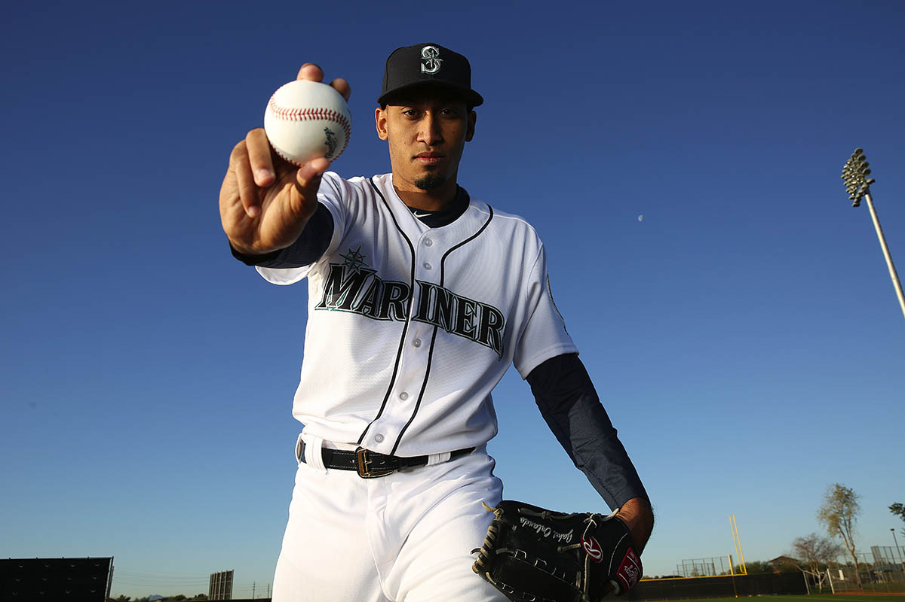

*Fastball or slider?*

There was only one choice in the mind of Edwin Diaz. His heart was pounding as adrenaline powered by intensity and irritation pulsed through his body. It was already elevated given the situation — one out, 10th inning, scored tied at 3-3 in a semifinal game of the World Baseball Classic at packed Dodger Stadium.

*How dare he show me up?*

Diaz stood on the mound and stared down the behemoth that was screaming at him and being restrained by his catcher, Yadier Molina. The sleepy eyelids that hide his chocolate-colored eyes barely blinked. He was simply waiting for Wladimir Balentien to get back in the batter’s box so it would all be over in quick and potentially embarrassing fashion.

The confrontation started with the first two pitches of the at-bat. Diaz fired a first-pitch fastball at 98 mph that Balentien took a vicious swing at and fouled back. Balentien, who had homered earlier in the game and is a prior home run champion in Japan’s Nippon Professional Baseball league, stared down Diaz from the box, giving him a look acknowledging he just missed the pitch and nodding at the pitcher.

Diaz nodded as if to say, “I got more of that.” And he did. On the second pitch of the at-bat, Diaz fired a 100-mph pitch at Balentien, who again hacked at it angrily, fouling it back. Balentien followed with another stare at Diaz and more head nodding and could be seen saying, “I’m on that.”

<? <%= t.include("_inlineNav.html", { page: "diaz" }) %> ?>

Then things got interesting. Diaz’s third pitch was another fastball at 99 mph. It ran up and in under Balentien’s chin. Was it a purpose pitch, perhaps reminiscent of his childhood hero Pedro Martinez, whom he got advice from and exchanged phone numbers with earlier that day?

“It wasn’t a purpose pitch,” he said. “(Molina) called fastball away. But I tried to throw the hardest I can.”

Regardless of intent, Balentien was unhappy, screaming at Diaz from the box and pointing at his head. Players from both benches started to spill onto the field and jawing from both sides escalated but nothing more followed. Umpire Lance Barksdale issued warnings to each team. Through all the chesty histrionics, Diaz’s expression remained unchanged. He wasn’t afraid or intimidated by Balentien. 

“I was relaxed,” he said with a smirk.

So what would Diaz do on the 1-2 pitch?

*Fastball or slider?*

From Puerto Rico’s bullpen, reliever Emilio Pagan, a teammate of Diaz for the previous four seasons in the Mariners’ minor-league system, had his own thoughts.

“I don’t know what the plan was, but I was in the bullpen screaming, stay with the fastball,” Pagan said. “For me, when Balentien was kind of staring him down, I was like: ‘All right, you’ve had a good game, but those were foul balls and Diaz is a different monster.’ I wanted him to stay with the fastball.”

In his condo in Arizona, Steve Cishek, who lost his closer’s job to Diaz, watched his teammate on television with anxiety. He’d pitched in the WBC in 2013 and could almost feel that tension again.

“My wife and I were watching and I said, ‘he’s going to throw a heater right here,’” he said.

Diaz rocked back a fired a fantastic running fastball at 99 mph that painted the outside corner to freeze Balentien looking for a called strike three.

</main>

  
  
Gregory Bull / The Associated Press

  

    Puerto Rico pitcher Edwin Diaz reacts after getting the last out to defeat the Dominican Republic in a second-round World Baseball Classic game in San Diego. Puerto Rico won, 3-1.
    

<main class="article-content">

The thought of throwing anything else but the fastball never entered his mind.

“I was going with the fastball,” Diaz said. “He had the two foul balls and he kept looking at me. And I said in my mind, ‘I’m going to strike him out with my fastball.’”

Back in Arizona, general manager Jerry Dipoto watched intently. Even from the short amount of time he’d gotten to know his young closer, he had his expectations.

<iframe src='http://m.mlb.com/shared/video/embed/embed.html?content_id=1244001883&topic_id=6479266&width=400&height=224&property=mlb' width='400' height='224' frameborder='0'>Your browser does not support iframes.</iframe>

“Exactly what he did,” Dipoto said. “I knew he would, because we have a feel for Edwin. He painted a 98-mph fastball down and away. And that’s Edwin. He’s got confidence in himself. He knows who he is. His fastball is just as hard to hit as his slider is, if not more so.”

Diaz closed out the inning with another strikeout and then pitched out of the 11th inning with a key double play. Puerto Rico would lose to the U.S. in the championship and Diaz wouldn’t throw a pitch in the game. Still, he had produced one of the signature moments of the WBC.

It was yet another reminder of how far he’d come so quickly. A year ago, he was one of a hundred pitchers getting his daily work in on the sun-baked backfields of the Mariners complex in Peoria.

The path to that moment wasn’t direct or as mercurial as one of his hissing, triple-digit fastballs. It wasn’t as simple as being made a reliever and going from there. A player doesn’t just elevate himself into that moment, embrace the pressures that come with it and then own it with vigor by serendipity, happenstance or luck.

</main>

  
  
Ken Lambert / The Seattle Times

  

    Mariners pitcher Edwin Diaz, wearing his WBC cap, identifies himself for his portrait during picture day at spring training in Peoria, Ariz.

<main class="article-content">

## The roots

Edwin Diaz Sr. is a man slight in stature but oversized in presence and personality. His energetic mannerisms and shoulders-back gait are noticeable in his son. He played baseball as a kid, but basketball was his sport and passion. At just about 5-9, Edwin Sr. was a lightning-quick point guard, a fierce competitor and unafraid to have the ball in his hands when the game was on the line.

His son’s 6-3 frame and freakishly long arms come from his wife, Beatrice, who stands almost 5-10. In her youth, she excelled at volleyball, softball and track and field.

Standing in front of his seat at Dodger Stadium with the crowd roaring and his son standing calm in the cacophony, Edwin Sr. knew what his son would do on the 1-2 pitch to Balentien.

“Oh, he was throwing the fastball,” Edwin Sr. said. “He’s not afraid of anyone.”

He didn’t raise his two sons, Edwin Jr. and Alexis, to shrink from moments like this.

“I got that from my father,” Diaz said. “I need to be confident. He put that in my mind when I was kid, and every time I try to be like that.”

Edwin Sr. would take his lessons learned in basketball and apply them to baseball situations. The idea of competing is universal in sports.

“We talked about it even as a little kid, the mental things of the game to get him strong,” Edwin Sr. said. “That the moment won’t impact you and having the mental strength to not be impacted by the moment. I worked with both Edwin and Alexis about the mental strengths of the game.”

But the focus was also on having fun and developing a passion for the game. Not that he had to try with his oldest son.

</main>

  
“Oh, he was throwing the fastball. He’s not afraid of anyone." 
  
 - Edwin Diaz Sr.

  
  
Ken Lambert / The Seattle Times

  

    Edwin Diaz sits and smiles during a break at Mariners spring training in Peoria, Ariz.

<main class="article-content">

“Every day, he would have a bat in his hand and a ball and a glove,” Edwin Sr. said. “He drove me crazy with it.”

After playing  basketball and baseball as a child, a tournament conflict one weekend forced Diaz to choose baseball, and he never looked back.

There was never a focus on pitching immediately. Diaz played all over the field and enjoying the game, but eventually his father pushed him toward the mound to take advantage of his long arms and whippy throwing motion.

To reward his baseball-obsessed sons, Edwin Sr., who was not man of great financial means, took them to Puerto Rican professional games and later the WBC qualifiers. It was there that Diaz dreamed of representing Puerto Rico.

The son reciprocated on the gifts of his youth by taking his father through the entire WBC process.

“He felt proud,” Diaz said. “He had a lot of fun during those games. He was with us — all the players. He traveled and did everything with us. That was my gift to him to be with me in all that stuff. As a kid, he pointed me in the right direction and I wanted to give back.”

The lessons instilled in Diaz by his father became apparent as teams started to scout him as a high schooler. Playing on the same travel team as phenom and future No. 1 overall pick Carlos Correa, Diaz made sure he didn’t languish in his friend’s shadow.

“Correa was obviously a top guy,” said Tom McNamara, who was the Mariner director of amateur scouting at the time. “But Edwin — whenever there were 50-60 guys there, he wasn’t afraid. His body language was like: ‘This is what I want to do. I’m ready to do this. There’s going to be no doubt that I’m going to give it everything I have.’”

Some kids fold under the gazing eyes of baseball scouts, often middle-aged men armed with radar guns. Diaz embraced their presence and used them as fuel to his performance.

“I wasn’t afraid of them,” he said. “I needed to show them my stuff. I needed to show them I could pitch. They liked me and that’s why I’m here.”

He acknowledged the scouts and interacted with them in total ease. He was quick to introduce his father, mother and brother, who never missed a game.

“He would just walk right up and say, ‘This is my family,’” McNamara said. “Not a lot of kids will do that.”

He was all personality.

“After doing this for a while, sometimes you look back at some of the high school guys and what was it about them that got you excited about not only writing the report but going back and seeing them again? Was there enthusiasm?” McNamara said. “Diaz always had that enthusiasm for the game. It sounds corny. But he loved the game at an early age. And you never worried about him being on Field 7 in Arizona in late August hating it. He was loving it.”

But attitude only gets you so far. Talent is the separator and Diaz had it. While everyone eyed Correa, the Mariners also watched Diaz in an array of situations.

“In high school, he was probably 140-145 pounds — skinny but a good arm,” McNamara said. “He was 91-92 and up to 94 mph. We saw him in a lot in showcases and we wanted to see him pitch and get him stretched out to pitch multiple innings. It wasn’t just let me get on the mound and light the gun up. There was some feel for pitch ability.”

They selected Diaz in the third round of the 2012 draft with the 98th overall pick.

“We were excited when we took him,” McNamara said. “We knew the kid was ready to go.”

</main>

  
  
Ken Lambert / The Seattle Times

  
Mariners closer Edwin Diaz shows his grip at spring training in Peoria, Ariz.

<main class="article-content">

## The conversion

The decision to convert Diaz to reliever didn’t happen all at once. It was a process of thinking, evaluating and re-evaluating. The final call came sometime in mid-May 2016. But the topic was first discussed on Dec. 7, 2015 — the first night of the MLB winter meetings in San Diego.

Diaz’s name had come up in trade talks. Dipoto had never seen Diaz pitch much in person, having taken over as general manager just months before. He knew the right-hander’s resume — Mariners’ minor league pitcher of the year in 2015 after going 7-10 with a 3.82 ERA combined between Class A and Class AA. In an organization thin with high-level prospects, Diaz was their best pitching prospect.

<blockquote class="pullquote">
  "I wasn’t afraid of them. I needed to show them my stuff. I needed to show them I could pitch."
  
- Edwin Diaz

</blockquote>

“We had all of our baseball people together, and we had a group discussion on Edwin Diaz,” Dipoto said. “Is he a starter? Is he a reliever?”

This kind of debate isn’t uncommon for teams. There was discussion, a breakdown of every possible statistic both traditional and sabermetric, there was video of his delivery played over and over with critique of his delivery and pitches.

“This went on for three hours,” Dipoto said. 

In the end, no consensus was made. Diaz would remain a starter and report to minor-league camp and start the season as a starter in Class AA Jackson.

“We also determined there was too much value in him, whatever his role was going to be, to include him in a trade,” Dipoto said.

Thoughts of converting Diaz to a reliever returned a few months later when he reported to Mariners’ minor league minicamp and Dipoto watched him throw bullpen sessions, live batting practice and in a game situation.

“It started up again because I said, ‘Are we sure that there’s enough upside here as a starter to overrule what could be a really dynamic reliever?’” Dipoto said. “And then we started to talk about the difference that he could make on this team. No, we would not have assumed that it was going to happen as quickly as it did.”

</main>

  
  
Courtesy of Cody Cunningham / Jackson Generals

  
Edwin Diaz pitching for the Jackson Generals in 2016.
    

<main class="article-content">

## The progression

Diaz made five starts with Class AA Jackson with decent success, posting a 2-3 record with a 3.00 ERA, striking out 35 batters and walking just five in 27 1/3 innings pitched. But after throwing two innings in his sixth start, he was pulled from the game without warning. After the game, Daren Brown, explained to Diaz the organization’s decision to convert him to reliever.

“They sat down with him, and they walked him through it,” Dipoto said. “We told him: ‘This will be the quickest route for you to get to the big leagues. We feel like it is your highest potential for impact in the big leagues.’”

Diaz was stunned.

“I didn’t know what to think,” he said. “I’d always been a starter, but I knew I wanted to get to the big leagues.”

While Dipoto believed it was the right move, he also allowed for the possibility of being wrong.

“We spoke to his agent at length about the move as we were transitioning him,” Dipoto said. “And the one thing we promised ourselves and the promise we made to Edwin, was that we would only switch one time. That we were going to send him to the bullpen and he was going to pitch the rest of the season as a reliever. And we were going to see where this took us. And if at the end of the year it was not a positive experience, or he didn’t enjoy it, or it wasn’t as big an impact as we thought it could be, we would transition him back to a starter, and we would restart his development. No harm, no foul, at 22.”

Six days later at Regions Field in Birmingham, Ala., Diaz the reliever entered the game in the eighth inning. It was a 13-pitch awakening.

“Blowing out everybody with my fastball,” he recalled. “I think I only needed to throw a couple of sliders.”

<aside class="side-img photo">
  
  
Courtesy of Cody Cunningham / Jackson Generals 

  
Edwin Diaz pitching for the Jackson Generals in 2016.

</aside>

Marcus Littlewood had been catching Diaz for the last few seasons. He couldn’t believe the change in Diaz.

“It was like his whole mentality changed,” Littlewood said. “He knew he was going to throw just one inning so he was going all out. His stuff was just electric.”

There was no reason to save anything. Diaz touched 101 mph that night.

“The movement, it’s almost like a guy throwing 90 mph sinkers, but it’s 100,” Littlewood said. “It’s tough to catch. I can’t imagine trying to hit it.”

Diaz scrapped his changeup and stayed fastball and slider. The moment he knew that this was working came in his second relief appearance, his first two-inning stint.

“I struck out five in two innings,” he said. “And I thought, ‘wow, I can be a good reliever.”

 His teammates knew Diaz was not long for the Southern League.

“We just kind of knew right there, he was on the fast track to the big leagues,” Dan Altavilla said.

That track was even faster than the Mariners expected. With a bullpen lacking a power arm and in desperate need of some help, the Mariners called him up on June 4 from Jackson, skipping the Class AAA level. He had made 10 appearances, allowing one unearned run 11 2/3 innings with 15 strikeouts and two walks.

Diaz arrived at Globe Life Park in Texas and wandered around lost. He asked a man if he could help him find where the visitors’ clubhouse was. That man was Dipoto.

“I think I can help you out,” Dipoto told Diaz.

</main>

  
  
Ken Lambert / The Seattle Times

  
The scoreboard at Safeco Field flashes "100 MPH," one of many triple-digit pitches thrown by Edwin Diaz.

<main class="article-content">

Two days later at Safeco Field, Diaz made his major league debut to minimal fanfare, entering in the seventh inning with the Mariners trailing 3-1.

With nervous energy pumping through his body and baseball-sized butterflies in his stomach, he rocked back and delivered his first big league pitch — a riding fastball at 96 mph for a strike to Chris Gimenez. The at-bat would end in a groundout.

But it was the second batter that left his teammates and fans buzzing.

Relaxed after getting that first out, Diaz went into attack mode on left-handed hitting Tyler Naquin.

His first pitch was a 99 mph fastball on bottom part of the zone for a strike — an almost unhittable first pitch.

Feeling the adrenaline surge, Diaz went back to his heater — again at 99 mph — this time painted on the inside corner for strike two. Naquin could only shake his head.

*Fastball or slider?*

There was no choice. Diaz knew Naquin would be prepared for it. To Diaz, it was more than just a strikeout. It was a display of who he was and what he wanted to become. Diaz went to the fastball again. Even prepared for it, Naquin just waved feebly at the 100-mph seed.

“I just tried to blow them out with my fastball,” he said.

Sound familiar?

Diaz worked a scoreless inning and left to a standing ovation from the crowd of just over 15,000 in attendance.

“After that first game, (manager Scott Servais) looked at me, he goes, ‘You know, it’s a matter of weeks until this guy’s closing,’” Dipoto said, “because it had that kind of feel to it.”

</main>

  
  
Photos by Ken Lambert / The Seattle Times

  
Mariners closer Edwin Diaz pumps his arms to celebrate a game-sealing save over the Tigers on Aug. 8, 2016 at Safeco Field.

<main class="article-content">

## The closer

Hours before the Mariners would face the Red Sox at Safeco Field on August 1, Servais held his daily pregame media session. His closer — Cishek — was in the midst of an awful stretch and had just coughed up another game the night before. The cries for Diaz to be the closer had grown within the fanbase. Servais had to follow that premonition of what he told Dipoto the night Diaz made his debut.

“He’s thrown the ball great,” Servais said that day. “That’s obviously the logical choice. He’s ready for it. There’s no doubt.”

That night, Diaz was called on to protect a 5-4 lead in an environment that didn’t quite feel like a home game with Safeco being overrun by Red Sox fans. He struck out Jackie Bradley Jr., walked Travis Shaw and struck out Sandy Leon and Andrew Benintendi.

From there, Diaz would finish with 18 saves with the Mariners. He wasn’t always perfect. He gave up walk-off homer to Rougned Odor in Texas on Aug. 30 trying for a six-out save for the first time at the MLB level. He blew two more and walked the tight rope in others as fatigue set in. But it was in those moments that Dipoto know his decision was right.

“My favorite times were watching how he handled the adversity later in the season when he tired, and he blew a couple,” Dipoto said. “It wasn’t as easy for him, and his reaction. I closed as a rookie, and I didn’t do it a third as well as Edwin does it. But you learn very quickly how to mature and how resilient you are.”

Besides the 18 saves, Diaz posted ridiculous strikeout numbers. He punched out 88 batters in 51 2/3 innings for a rate of 15.33 strikeouts per nine innings. He struck two or more batters in 29 of his 49 appearances.

“Edwin is the exception to many rules,” Dipoto said. “The guy who goes from AA starter to big league closer in a month. The guy who frankly came into camp last year, and wasn’t on anybody’s radar other than, this guy’s got an interesting arm. He is an exception to the rule of the young pitcher who comes to the big leagues and seems unaffected by the drama, the significance of the role he’s playing on a team.”

His status was only verified with his perforamnce in that WBC semifinal.

“I thought that was his moment that frankly we can’t replicate, in player development, in spring training,” Dipoto said. “We can’t replicate anything like that. The Mariners haven’t played a game in a decade and a half where we could replicate that. He’s just got experience that we could not possibly pay for in player development or in preparing a young guy.”

*Fastball or slider?*

If the Mariners are playing in a game to end their postseason drought or perhaps their first playoff game since 2001 and that dilemma arises for Edwin Diaz late in the game, they know he won’t wither in the moment. It’s simple.

“Just go after them without fear,” Diaz said.

