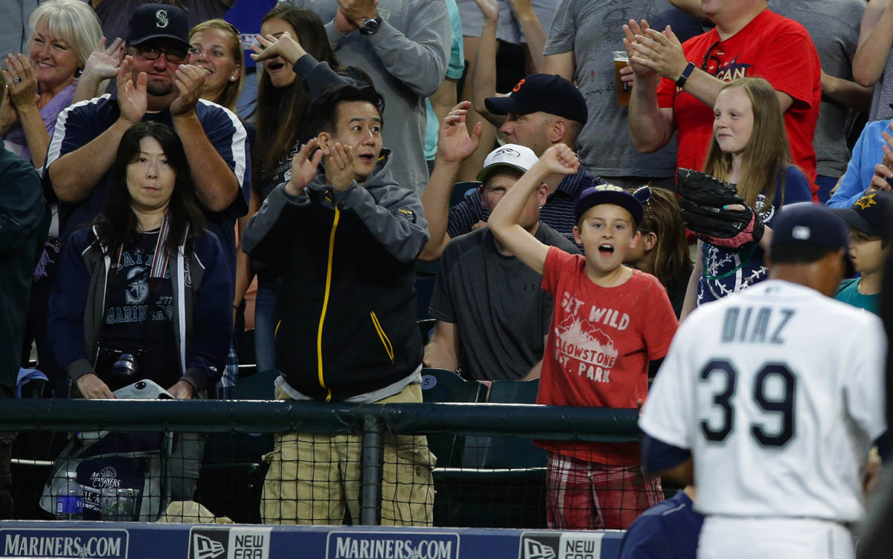

The first should not be forgotten.

Edwin Diaz emerged from the bullpen of Safeco Field and jogged to the mound on June 6. No one was quite sure what to expect from the young right-hander who looked to be all legs and arms and missing a backside on his 6-foot-3, 165-pound frame. 

Some of the crowd of 15,824 cheered for the youngster making his debut out of courtesy. But only the diehard fans who follow the Mariners’ prospects understood the importance of the evening. Diaz had been the organization’s minor league starting pitcher of the year in 2015 and was converted to a reliever in the first month of the 2016 season. Though dominant, he’d made just 10 relief appearances for Class AA Jackson before being summoned to the big leagues to provide a soft-tossing Seattle bullpen with a legitimate power arm. 

<? <%= t.include("_inlineNav.html") %> ?>

Diaz had been called up two days earlier and manager Scott Servais waited for the right time to bring him in for a “soft landing” in his debut. With the Mariners trailing 3-1 and getting shut down by Cleveland starter Trevor Bauer, Diaz entered the game in the bottom of the seventh in relief of James Paxton to not led the lead grow. 

With nervous energy pumping through his body and baseball-sized butterflies in his stomach, he rocked back and delivered his first big league pitch — a riding fastball at 96 mph for a strike to Chris Gimenez. He got a swinging strike two on a nasty slider. His third pitch was a 99 mph fastball for a ball. Another slider got a ground ball to third base for an easy first out. 

It was then you could see Diaz exhale as he circled the mound. That first out made things easier. Now he could go. Now he could relax. And what came next was special. 

His first pitch to the next hitter — Tyler Naquin — was a 99 mph fastball on the bottom part of the zone for a strike. It was an almost unhittable first pitch. 

Feeling the adrenaline surge, Diaz went back to his heater —  again at 99 mph — this time painted on the inside corner for strike two. Naquin could only shake his head.

<aside class="aside-photo"></aside>

It was the third pitch of the at-bat where Diaz inserted himself into the Mariners’ fans hearts. And it was the third pitch where it became evident that this kid that was all arms and legs and no backside might be something special. 

With no hesitation, he went to the fastball again. Diaz knew Naquin would be prepared for it. And he didn’t care. Why? Because it didn’t matter. Diaz went into his awkward delivery that seems fitting for his Gumby-esque frame. And as his bullwhip of a right arm rocketed through and released the baseball toward home, sending it on a hissing, riding path of fury, it was over for Naquin. 

The fastball that he knew was coming wasn’t going to be hit. He swung, missed and walked to the dugout, looking at the stadium radar gun, which read 100 mph. It drew oohs from the few fans there. Many stood and cheered for Diaz’s first big league strikeout as he stalked around the mound. 

  <iframe src='http://m.mlb.com/shared/video/embed/embed.html?content_id=783846883&topic_id=32862096&width=360&height=201&property=mlb' width='360' height='201' frameborder='0'>Your browser does not support iframes.</iframe>

Every pitcher remembers his first strikeout and the details of it. But it’s not often that fans remember it, too. 

The inning wasn’t over. Facing Rajai Davis, Diaz flipped a nasty slider for a swinging strike one and then came back a 100 mph fastball on the outside corner to make it 0-2. Fans in the stands rose to their feet cheering in anticipation. Diaz unleashed another fastball. This time it was 101 mph. Davis got a piece of it and fouled it back off the mask of catcher Chris Iannetta. The sheer force and angle knocked Iannetta’s mask off his face. 

Diaz wouldn’t get the punch out on Davis, who grounded out on a slider to end a perfect first inning. But Diaz would go on to get 87 more strikeouts in his rookie season. He would eventually take over closing duties and is looked to as an integral part of the Mariners future as the closer for this year and beyond. 

But that first strikeout with three fastballs — 99 mph, 99 mph and 100 mph — was the beginning of something special. 