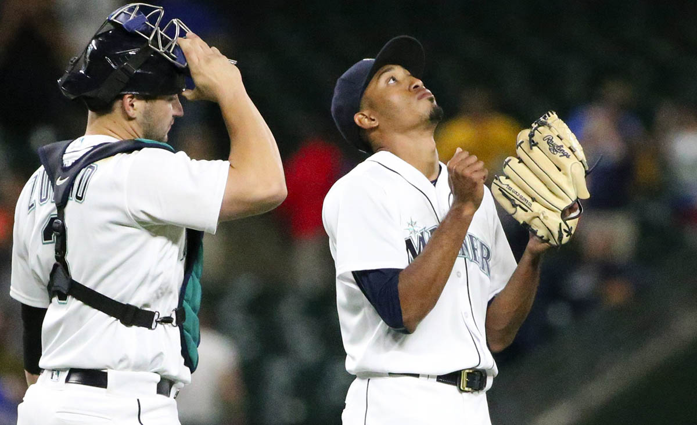

It is said baseball is a game of inches. In reality, it’s a game of milliseconds. 

Consider baseball’s most basic interaction – the one that takes place 60 feet, 6 inches apart roughly 300 times a game for 162 games each season.

The pitcher versus the hitter. 

It’s a mental chess match. The pitcher gazes in for the sign, scratches at the clay with his foot, searching for the right plan of attack with his grip on the ball. The hitter meets the pitcher’s eyes, a wooden weapon waiting rhythmically on his shoulder.

<?<%= t.include("_inlineNav.html", { page: "science" }) %>?>

“There’s something primal about this confrontation between a man with a rock and a man with a stick,” said Jonathan Hock, writer and director of the documentary “Fastball.” 

These duels are a microcosm of baseball’s intricate structure of snap decisions. So what happens when man with rock harnesses the power to throw a pitch 100 miles per hour?

“There’s something instinctive in us as baseball fans that we sense at some level that this is the limit of human performance. Somehow, in your gut, you know that nobody else is going to walk on that mound and throw it a lot faster than that,” Hock said. “When you see the limits of human performance on both sides of this confrontation, it’s breathtaking.”

Despite what your little league coach might have taught you, the exchange isn’t quite as simple as “see ball, hit ball.” Not when it comes to 100-mph heaters.

<?<%= t.include("science/_scrolling.html", { stage: "overview" }) %>?>

A 100-mph fastball takes roughly 375-400 milliseconds to reach the plate. For reference, the blink of an eye takes 300-400 milliseconds. 

So now that we’ve established a 100-mph fastball gets to the plate in roughly the amount of time it takes for you to shut your eyelid and reopen it, let’s break down what a hitter has to do in order to put the barrel of a  wooden bat on that 100-mph fastball.

<?<%= t.include("science/_scrolling.html", { stage: "processing" }) %>?>

First, the hitter must process the ball coming at them. The brain quickly races to identify the thrown object, but this process takes about 75-100 milliseconds, according to neuroscientist Jordan Muraskin.

Muraskin teamed up with fellow neuroscientist Jason Sherwin to form deCervo, a company that uses baseball to examine the brain’s cognitive ability in short decision-making windows of time. The two work with college and MLB teams to measure and improve hitters’ reaction times, especially when it comes to the fastest of fastballs.

“You are limited by your nervous system in that you have 75-100 milliseconds of processing lag time,”  Muraskin said.

After this processing lag time in which the hitter recognizes an object moving toward him, he must identify and react to the pitch. What kind of pitch is it, and where is it going? 

While most decisions are made in the front part of the brain, which deals with deliberative thought, this decision is made in the motor area of the brain, which deals with more instinctive reactions. This is when the hitter decides the most crucial step: to swing or not swing. 

<?<%= t.include("science/_scrolling.html", { stage: "swing" }) %>?>

Once the hitter decides, it’s a race against the waning milliseconds to make contact. The quickest swings in baseball happen in anywhere from 100-150 milliseconds, leaving almost zero margin for error. 

<?<%= t.include("science/_scrolling.html", { stage: "decision" }) %>?>

“You really only have about 150 milliseconds to make a decision while the pitch is coming toward you,” Muraskin said. “A fair and foul ball, the difference is having your bat in the right place by about 5-7 milliseconds.”

When the pitch speed dials up to triple digits, hitters can have great difficulty even tracking the direction of the ball.

“The good hitters are able to slow the ball down,” said new Mariners first baseman Danny Valencia. “You have to essentially slow down the pitch so it doesn’t look as hard.”

Easier said than done. Valencia, who last season faced M’s flamethrower Edwin Diaz, went 0 for 2 with a strikeout and a groundout.

“He’s got electric stuff,” Valencia recalled of Diaz. “The numbers don’t lie, and he’s got a lot of strikeouts. You’ve got to go up there and be aggressive. It’s definitely a tough at bat. You’ve got to simplify everything with a guy like that.”

Like a shutter speed in a camera, the hitter’s brain tracks the pitch by taking rapid snapshots of the ball and its trajectory. But the speed of the pitch creates holes that can’t be processed quick enough.

“The ball is essentially outracing your eye,” said Hock, who worked with neuroscientists and MLB hitters for his film. “Your eye doesn’t track an object in motion with 100 percent constancy.”

  
  
Ken Lambert / The Seattle Times

  

    Mariners closer Edwin Diaz looks skyward after saving the game against the Yankees, Monday, Aug. 22, 2016, at Safeco Field in Seattle.

“With a fastball, when it approaches 100 mph, it hits a speed that is right at the limit of the fastest a human eye can track in a moment,” he continued. “When the ball is outracing your eye, you think it’s going to a place where an ordinary pitch will go, and then it’s not there when you hit it; your brain has an error message.”

Say a 100-mph fastball takes 375 milliseconds after the pitcher releases the ball to reach the plate. After lopping off the first 75-100 milliseconds in “processing lag time,” and 100-150 milliseconds needed to swing, the hitter is left with almost no time to decide what kind of pitch it is, where it’s going, and whether or not they will attempt a swing. The chess match becomes a guessing game. 

(PLAYER QUOTE -- why hitters look so foolish vs. 100+)

“You’ve cut a very large portion of your ability to really decide,” Muraskin said. “That ability to decide how close or not close it’s going to be to the plate becomes much harder, and putting it in play becomes much harder.”

 In this  showdown between man with rock and man with stick, it’s nearly impossible to accurately process and react when man with rock throws 100 mph. 

Whether you’re trying to hit or just watch, you better not blink.
