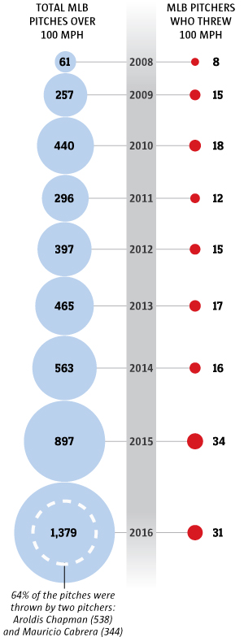

  "It used to be that the home run was the slam dunk of baseball, now it’s the 100 mph fastball."
  
- Jonathan Hock, writer and director of the documentary “Fastball.”

On the ninth pitch of his first appearance in the majors, Edwin Diaz  fired a second strike past the Indians’ Rajai Davis. The reading on the stadium radar gun: 100.3 mph.

It was the 13th-fastest out of 24 100-mph-plus pitches Diaz would throw from his June 6 debut to the end of the 2016 season. 

Yet those two dozen hundred-plus heaters comprised only a sliver of the total across baseball. 

<?<%= t.include("_inlineNav.html", { page: "trends" }) %>?>

Thanks largely to the Yankees’ Aroldis Chapman,  MLB pitchers combined to throw 1,379 pitches that clocked triple digits in 2016, the most prolific year of flamethrowers the game has seen. (Chapman, who accounted for 538 of those pitches, was suspended 30 games last season because of his involvement in an alleged domestic violence incident during the previous offseason.)

The 1,379 pitches was a 53.7 percent increase over 2015 and nearly 1,000 more than 2010, the year a 22-year-old Chapman debuted in the Reds’ bullpen.

What in 2008 was a group of eight led by Joel Zumaya had swelled to 34 pitchers to hit 100 mph in 2015 and 31 in 2016 — including four Mariners, more than any other team.

  
  

    
EMILY M. ENG / THE SEATTLE TIMES

    
Source: baseballsavant.mlb.com

  

“It seems like everyone out of the pen these days is throwing in the high 90s. The game’s definitely evolving,” Mariners infielder Danny Valencia said. “Guys are getting bigger, faster, stronger. I think the games obviously changing and with nutrition, exercise and modern medicine, it seems like guys are becoming way more athletic and are able to do more impressive stuff. It’s definitely more challenging as a hitter to hit those guys.”

It took all of 13 Class AAA starts in 2010 of Chapman showcasing his record-breaking fastball but little else for the Reds to cut the string and allow his two-pitch repertoire to begin dominating out of the big league bullpen. Six years later, Diaz entered the eighth inning of  Class AA Jackson’s game and the next day general manager Jerry Dipoto announced the Mariners were doing the same.

<? <%= t.include("partials/_ad.html", { type: "square" }) %> ?>

“We felt like as a starter he’s mostly 90-94 mph with a good slider,” Dipoto said at the time. “What happens when we dump him into a bullpen? Do we have a chance to get that back-end dynamic arm? And does that supersede the ceiling that he would have as a starter?”

Diaz’s early success was quantifiable, no matter your bent. His stat line included an average of nearly two punchouts an inning (15.33 K/9), a 2.79 ERA and an even lower FIP, 2.04. It took him only 51⅔ innings to accumulate 1.9 fWAR. Perhaps more impressive was his ability to blow his tailing four-seamer past batters and intermix a sweeping slider.

  

    

      <h1>Dramatic rise in pitchers throwing 100 mph or higher in past nine seasons</h1>
      

        In 2008, only eight pitchers in Major League Baseball could hit 100 on the radar gun. But since then, the numbers have ballooned and hard-throwing relievers are a trend.
    

    

      
    

  

  

    
EMILY M. ENG / THE SEATTLE TIMES

    
Source: baseballsavant.mlb.com

  

When the Reds converted Chapman, then-GM Walt Jocketty’s intentions were for it only to be temporary. Dipoto has shown no indication of considering moving Diaz, his slender frame and fastball-slider combo back into the rotation.

Despite the Reds returning each of the next two spring trainings to the infatuation of starting pitcher Aroldis Chapman, he inked a five-year, $86 million contract with the Yankees this offseason having never started a major league game. It was the largest contract ever given to a reliever, followed only by Kenley Jansen and Mark Melancon’s deals, all completed in the first two weeks of December 2016. 

Teams are spending more than they ever have on their bullpens, up 18.8 percent and nearly $100 million league-wide from 2016. Just to complete their bullpen, the Mariners handed 31-year-old middle reliever Marc Rzepczynski $5.5 million — a tick above the average annual salary given to a free-agent reliever this offseason, $5.3 million.

<?<%= t.include("trends/_by_team.html") %>?>

In his lone MLB season, current Mariners pitching coach Mel Stottlemyre earned $100,000 to appear in 13 games and post a 4.88 ERA for the 1990 Kansas City Royals. Elsewhere in the AL West, Bobby Thigpen set a then-record with 57 saves for the White Sox. Dennis Eckersley finished second, with 48 saves, and gave up five earned runs all season — a 0.61 ERA. Neither ever earned more than $7 million in today’s money, less than the $7.5 million the Phillies gave 39-year-old Joaquin Benoit after he threw 48 innings between the M’s and Blue Jays last season.

“Things have changed,” Stottlemyre said. “You look at the evolution of starters vs. bullpens and how the game has shifted. Very few times will you see a starter going deep in games now and you turn it over to guys in the back end of the bullpen who can all throw 95-100. Those guys are getting paid.”
